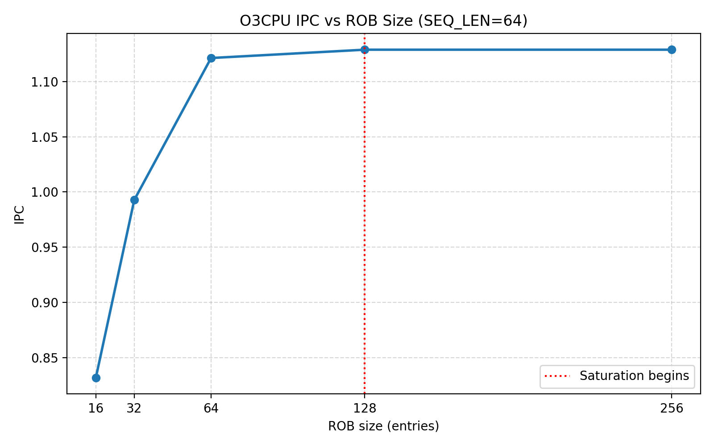
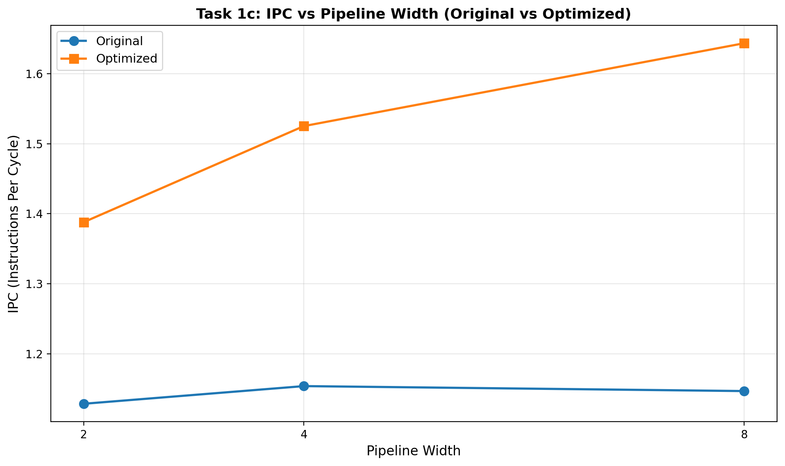

# First homework


## Task 1: Analyze performance of O3 processor (5 points)

You are given a program that computes **scaled dot-product attention scores** — the core non-GEMM operation in Transformer models. The source code is located in the `workload/scaled_dot_product.c` file.

To ensure consistent and comparable results across all submissions, all simulations must use the explicitly specified functional unit and cache configuration defined below. These parameters are fixed and must not be changed unless a task explicitly instructs you to vary them. The defult configuration of O3CPU and MinorCPU are definied in python files in folder `default/` and you can refer to them for more details.

### Task 1a:
First, report the following metrics from `stats.txt` for both CPU models:

| Metric | MinorCPU | O3CPU |
|---|---|---|
| CPI |  1.507109 | 0.885920 |
| Total cycles | 100800 | 59253 |
| IPC |  0.663522 |  1.128770  |

What is the IPC speedup of O3CPU over MinorCPU? Explain it.

The Instructions Per Cycle (IPC) speedup of O3CPU over MinorCPU is calculated:

$$\text{IPC Speedup} = \frac{\text{IPC}_{\text{O3CPU}}}{\text{IPC}_{\text{MinorCPU}}} = \frac{1.128770}{0.663522} \approx 1.70$$

The MinorCPU is in-order only, where O3CPU is out-of-order, which allows it to execute instructions more efficiently by reordering them to avoid stalls and better utilize the CPU's resources. 
O3CPU also performs speculatioveve execution(=branch prediction), which allows it to execute instructions before it is certain they are needed, further improving performance. It uses a large ROB, thath has 128 entries in curent configuration.

### Task 1b: 
For parameter `SEQ_LEN=64` of workload, run O3CPU with ROB sizes of 16, 32, 64, 128 and 256 entries and Plot IPC vs. ROB size. At what ROB size does performance saturate? What does this tell you about the instruction-level parallelism (ILP) available in this workload?

| Rob size   | 16 | 32 | 64 | 128 | 256 | 
|---|---|---|---|---|---|
| O3 | 0.831878 | 0.992742 | 1.121239 | 1.128770  | 1.128770  |



Performance saturates at ROB size = 128 entries. 

For `SEQ_LEN = 64`, the O3CPU was evaluated with ROB sizes from 16 to 256 entries, showing IPC increasing from 0.831878 (ROB 16) to 1.128770 (ROB 128), after which it remains unchanged at ROB 256. This indicates that performance saturates at a ROB size of 128 entries. The plateau suggests limited instruction-level parallelism (ILP) in the workload. The main cause is the dependency chain in the `dot_product()` loop, where each iteration depends on the previous accumulation. With `D_K = 64` and a floating-point multiply latency of 6 cycles, this creates a long critical path of about 384 cycles. As a result, the processor quickly runs out of independent instructions to execute in parallel. Increasing the ROB beyond 128 entries therefore provides no benefit, as the limitation is due to inherent data dependencies rather than hardware capacity.


### Task 1c:  
Rerun both the original and optimized version (`scaled_dot_product_adv`) of the attention kernel on O3CPU, sweeping pipeline width  over  2, 4, and 8 width of different stages to the same value. Record IPC for each combination and plot both versions on the same graph as IPC vs. pipeline width. Analyze whether the IPC gap between the two versions grows or shrinks as the pipeline widens, and explain what this reveals about the relationship between  ILP and hardware utilization.

| Pipeline Width   | 2 | 4 | 8 | 
|---|---|---|---|
|  1.128770 |  1.153991 | 1.146907 |
|  1.388050 |  1.525176 | 1.643418 |



The optimized version breaks dependency chains by using independent accumulators (96-cycle critical path vs. 384 cycles for the original). As pipeline width increases, wider pipelines expose more independent parallelism—but only the optimized version can exploit it because the original version is bottlenecked by its long dependency chain. The original version's IPC even decreases slightly (1.153 → 1.147), suggesting pipeline width isn't helping when instructions are serialized. This shows that better ILP (via loop unrolling) is essential for wider pipelines to be effective—without it, more execution bandwidth goes unused.

### Task 1d:
For both version, original and optimized, sweep the number of physical integer and floating-point registers over 64, 96, and 128 entries measuring IPC and the number of stalls caused by register file exhaustion (`system.cpu.rename.fullRegistersEvents`). Plot IPC and stalls vs. number of registers. At what point do additional registers stop improving IPC? Set the pipeline width to 2 and ROB size to 128 for this experiment. 

*Note: if you cannot find the `fullRegistersEvents` stat, than means that is equal to 0 , and you can report 0 for all of them.*

| Metric | 64 | 96 | 128 |
|---|---|---|---|
| IPC | |  |  | 
| Stalls |  | |  | 


| Metric | 64 | 96 | 128 | 
|---|---|---|---|
| IPC |  |  |  |  
| Stalls |  |  | |  

## Task 2: Branch Prediction and Speculative Execution in Masked Attention (O3CPU) (5 points)

In autoregressive Transformer models (such as GPT), the attention mechanism applies a **causal mask** to prevent each token from attending to future positions. Before the softmax is computed, all positions $j > i$ for query $i$ are set to $-\infty$, ensuring their contribution after softmax is zero. This masking introduces **data-dependent branches** whose taken/not-taken ratio changes systematically across query positions — early queries mask most of the sequence, late queries mask almost nothing. This makes the workload particularly interesting for branch prediction analysis: the branch behavior is neither fully predictable nor fully random, but shifts gradually across the outer loop iterations.

---

### The Workload

The program computes masked scaled dot-product attention for every query position in a sequence. It is located in the `workload/` folder. The two branches of interest are:

```c
void masked_softmax(float *scores, float *output, int query_pos, int len) {

    // Branch 1 — Causal mask
    // Taken ratio = (len - query_pos) / len
    // Shifts from ~100% (query 0) to ~0% (query SEQ_LEN-1)
    for (int j = 0; j < len; j++) {
        if (j > query_pos)
            scores[j] = NEG_INF;
    }

    // Branch 2 — Max reduction
    // Fully data-dependent, no learnable pattern
    float max_val = scores[0];
    for (int i = 1; i < len; i++) {
        if (scores[i] > max_val)
            max_val = scores[i];
    }

    // ... exp, sum, normalize (no branches)
}
```

---


### Task 2a
Compile and run the masked attention workload using the baseline configuration. Record the following from `stats.txt`:

| Metric | Value |
|---|---|
| Total instructions committed | 2194513 |
| Total cycles | 1774074 |
| IPC | 1.236991 |
| Branch instructions committed | 335874 |
| Branch mispredictions | 501 |


### Task 2b
Run the workload with the following four branch predictors (`TournamentBP`,`LocalBP`,  `BiModeBP` and `TAGE`), keeping all other parameters fixed. Record for each predictor:

| Predictor | Branch mispredictions  | IPC | 
|---|---|---|
| TAGE | 499 | 1.237033 | |
| LocalBP | 5430 | 1.203245 | |
| Tournament | 4673 | 1.214289 | |
| BimodeBP | 4788 | 1.212354 | |

*Note: Metric for branch mispredictions count is: `branchPred.condIncorrect` while the metric for Branch instructions committed is: `branchPred.committed_0::total`*


Which predictor achieves the lowest misprediction count and why?

The LTAGE branch predictor achieved the lowest misprediction count at 499. This is because TAGE uses multiple predictor tables with different history lengths, which allow it to capture both short and long-term branch correlations. This makes it very efficient for workloads with complex branch patterns. The other branch predictors rely on shorter branch history patterns, which make them less reliable and prone to mispredicting branches.

### Task 2c
Using the best-performing predictor from *Q2*, sweep ROB size over **32, 64, and 128 entries**:

Record for each ROB size:

| ROB Size | Misprediction count | IPC | Squashed instruction count |
|---|---|---|---|
| 32 | 499 | 1.088510 | 520 |
| 64 | 499 | 1.238335 | 478 |
| 128 | 499 | 1.237033 | 442 |

*Note: Metric for Squashed instruction count is: "core.numSquashedInsts"*

As ROB size increases, what happens simultaneously to IPC and to instructions flushed per misprediction?

As the ROB size increases, the IPC also increases, indicating better processor throughput. Meanwhile, the number of flushed instructions per misprediction decreases. A larger ROB allows the processor to keep more instructions in progress, including independent instructions that are not dependent on unresolved branches. This means the processor can commit more correct-path instructions before a misprediction is detected, so when a misprediction does occur, there are fewer speculative instructions left to be discarded. Thus, a larger ROB both improves performance and reduces the penalty for mispredictions.
